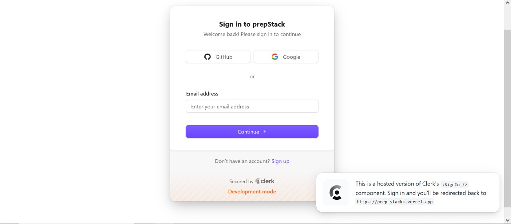
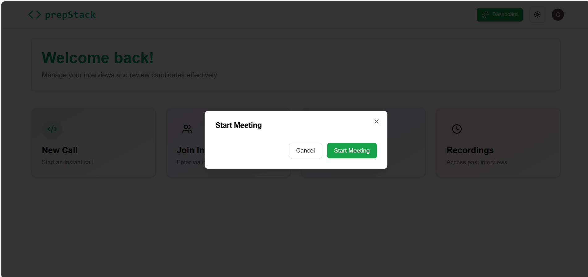
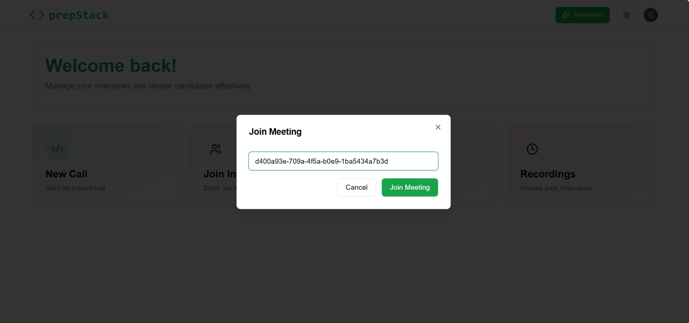
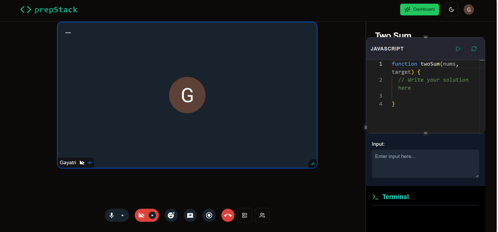
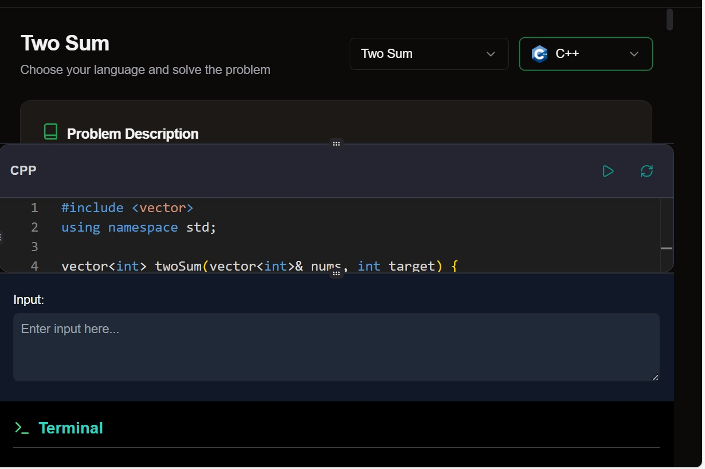
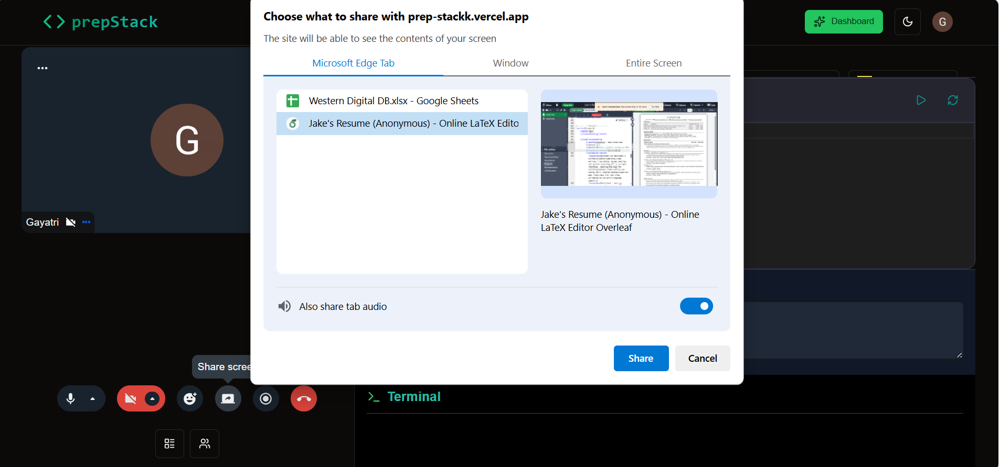
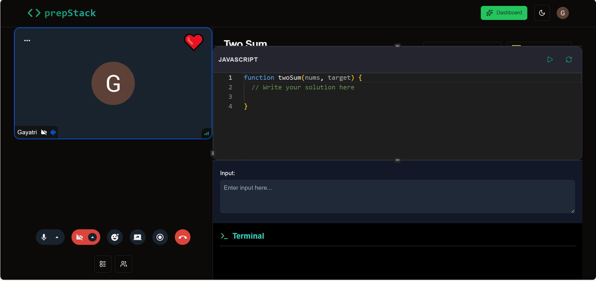
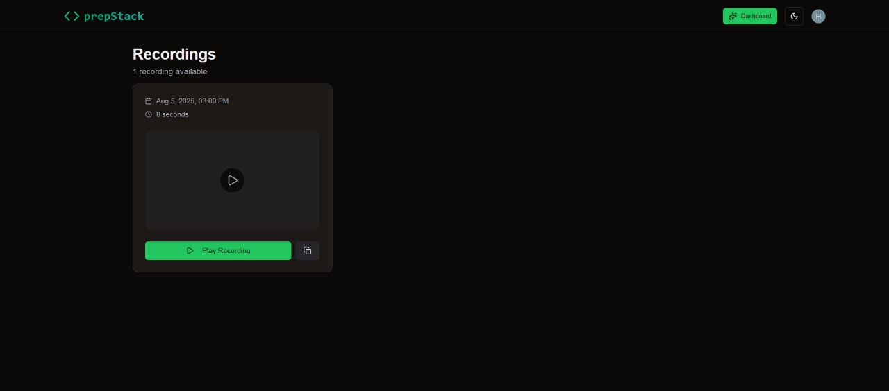
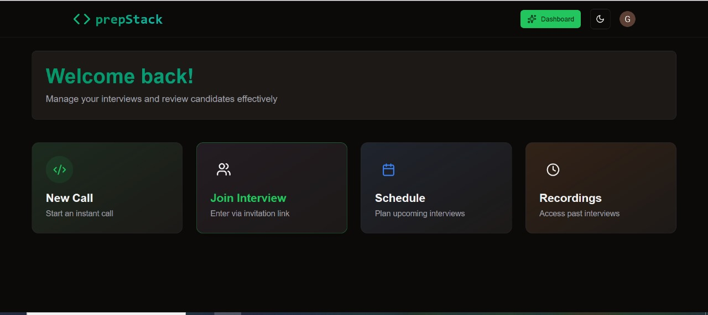

# 🧑‍💻 prepStack – Peer Mock Interview Platform

**prepStack** is a full-stack peer interview platform designed for seamless and effective mock interviews. It enables users to conduct interviews with integrated **video calling**, **collaborative coding**, **screen sharing**, **reactions**, **session recordings**, and **post-interview feedback** – all within a single unified interface.

---

## 🚀 Features

- 🔒 **Authentication**: Secure sign-in and sign-up with Clerk.  
  

- 📞 **Instant Interview Rooms**: Create a room instantly using the *New Call* feature. A unique meeting ID is generated to invite peers.  
  

- 👥 **Join via Link**: Peers can join interviews using the shared meeting ID or invitation link.
- 

- 🎥 **Audio/Video Support**: Toggle mic and camera on/off during interviews.  
  

- 🧑‍💻 **LeetCode-style Coding Interface**: Solve problems collaboratively in a real-time code editor with language support (JavaScript shown).  
  

- 🖥️ **Screen Sharing**: Share your screen to explain solutions or debug collaboratively.
-  

- 😀 **Emoji Reactions**: Send live feedback with emoji reactions during the interview.
-  

- 📹 **Session Recording**: Record interviews to revisit later for feedback and improvement.  
  

---

## 🏗️ Tech Stack

- **Frontend**: Next.js  
- **Backend / Database**: Convex  
- **Authentication**: Clerk  

---

## 🛠️ How It Works

### 1. Authentication

- Login or Sign Up using **Clerk authentication**.  
  

---

### 2. Dashboard

From the dashboard, users can:

- ✅ Start a **New Call** – instant meeting room with a sharable link.
- 🔗 **Join Interview** using an invite code.
- 📅 **Schedule Interviews** for later.
- 🎞️ **View Recordings** of past sessions.  
  

---

### 3. In the Meeting Room

- 🎥 **Camera & Microphone** previews.
- 👩‍💻 **Collaborative Code Editor** for solving problems together.
- 📤 **Screen Sharing**, 😄 **Emoji Reactions**, and 📹 **Recording** tools available.  
  

---

## 📌 Future Plans

- 🏆 **Leaderboards** based on performance.
- 🤖 **AI-powered interview feedback** and suggestions.

## 🛠️ Run Locally

Follow these steps to clone and run the project locally:

# 1. Clone the repository
git clone https://github.com/your-username/your-repo-name.git

# 2. Navigate into the project directory
cd your-repo-name

# 3. Install dependencies
npm install

# 4. Start the development server
npm run dev

Once the server is running, open your browser and go to:

http://localhost:3000
